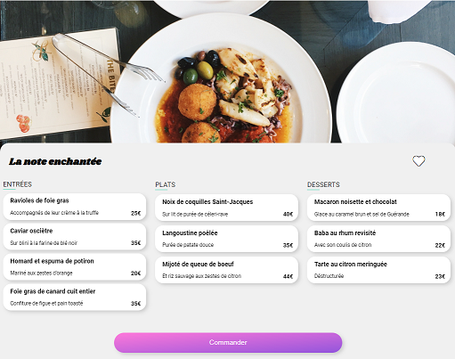

# Projet 3 Openclassrooms: ohmyfood

Le projet consiste à développer un site 100% mobile qui répertorie les menus de restaurants gastronomiques.
On est chargé de créer la partie Front-end du site, on doit réaliser un MVP en respectant la maquette fournie.
On doit aussi réaliser les animations demandées dans le brief entiérement en CSS.

## Démarrage

Le site est hébergé sur [Github-Pages](https://anthonyj408.github.io/JAMMESAnthony_3_25072021/)

## Fabriqué avec

* [Sass](https://sass-lang.com/) - Préprocesseur CSS

